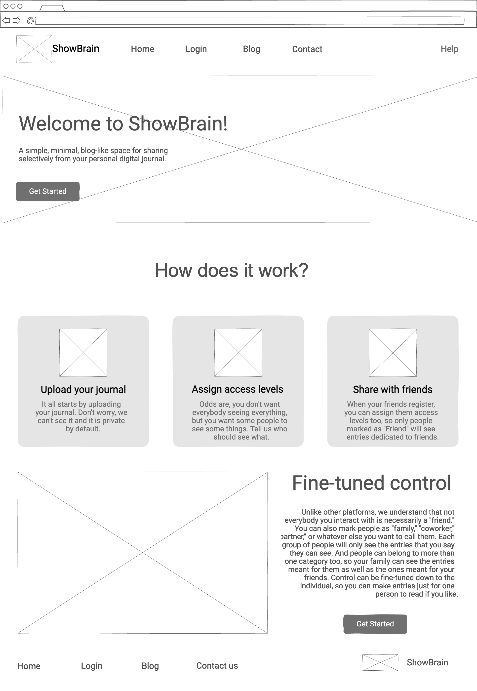
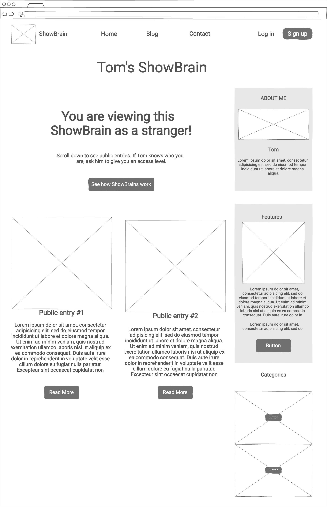
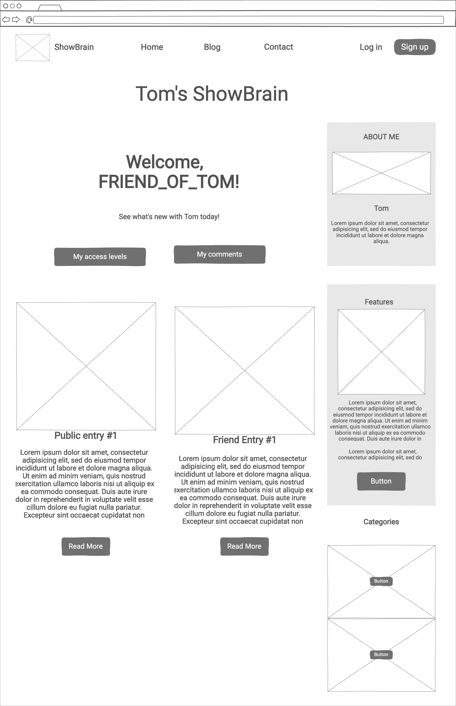
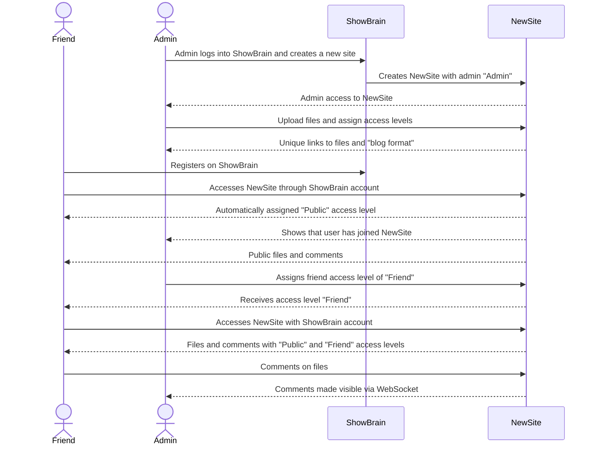

# ShowBrain

[My Notes](notes.md)

## 🚀 Specification Deliverable

For this deliverable I did the following. I checked the box `[x]` and added a description for things I completed.

- [x] Proper use of Markdown
- [x] A concise and compelling elevator pitch
- [x] Description of key features
- [x] Description of how you will use each technology
- [x] One or more rough sketches of your application. Images must be embedded in this file using Markdown image references.

### Elevator pitch

Do you ever have so much to say that you wish you could just… take your brain out and show someone? ShowBrain can help! It's like Facebook but for longform text content. (And without feeds and privacy issues.) It's a website that takes a collection of personal files (for example, class notes, or a digital journal) and helps you safely publish them for friends to see and comment on. By default, all files are private, and access levels are easy to configure: for example, allow your coworkers to access one set of files, allow your family to access all of those plus some more, let one specific friend have access to one specific file, and so forth.

### Design

Home page to become the admin of a new ShowBrain

ShowBrain of Tom as viewed by a stranger

ShowBrain of Tom as viewed by a friend

Here is a rough sequence diagram that shows how ShowBrain works. It is essentially a social media/blogging application, but with a focus on small groups and personal utility rather than making lots of things known to the public.

### Key features

- Secure register/login over HTTPS
- Upload personal documents/digital journal to publish them online
- Set and fine-tune access levels for each file or collection of files
- Allow friends to register, get assigned an access level, and stay connected by interacting with your documents

### Technologies

I am going to use the required technologies in the following ways.

- **HTML** - Provides the basic structure of the page, including the Home, Login, Public, Contact, and Help pages.
- **CSS** - Helps website adjust to fit any device and look nice
- **React** - Facilitates authentication and adjusts files that are shown based on the account's access level
- **Service** - Upload documents, assign access levels, publish to unique links, register/login to see files of different access levels. Use 3rd party API Genderize to infer gender based on name and offer "free" access level based on gender
- **DB/Login** - If a user does not login, they can see all files given the "public" access level. If they do, they can be assigned further access levels by the author so they can see more files.
- **WebSocket** - Commenting, liking, etc.

## 🚀 AWS deliverable

For this deliverable I did the following. I checked the box `[x]` and added a description for things I completed.

- [x] **Server deployed and accessible with custom domain name** - [showbrain.net](https://showbrain.net).

## 🚀 HTML deliverable

For this deliverable I did the following. I checked the box `[x]` and added a description for things I completed.

- [x] **HTML pages** - I added the following HTML files: about, blog, comments, dashboard, help, index, login.
- [x] **Proper HTML element usage** - I used `body`, `nav`, `main`, `header`, and `footer` correctly, among other HTMl elements
- [x] **Links** - All the pages are linked together appropriately
- [x] **Text** - Textual content, both real and placeholders, are present
- [x] **3rd party API placeholder** - The Genderize API didn't end up being a great idea, so I decided to put a placeholder for the PurgoMalum PAI in case there is ever profanity in the comments
- [x] **Images** - Real and placeholder images have been added.
- [x] **Login placeholder** - Login placeholder has been added
- [x] **DB data placeholder** - DB data placeholders have been added.
- [x] **WebSocket placeholder** - WebSocket placeholder has been added.

## 🚀 CSS deliverable

For this deliverable I did the following. I checked the box `[x]` and added a description for things I completed.

- [x] **Header, footer, and main content body** - I did it!
- [x] **Navigation elements** - I did it!
- [x] **Responsive to window resizing** - I did it!
- [x] **Application elements** - I did it!
- [x] **Application text content** - I did it!
- [x] **Application images** - I did it!

## 🚀 React part 1: Routing deliverable

For this deliverable I did the following. I checked the box `[x]` and added a description for things I completed.

- [x] **Bundled using Vite** - I did it!
- [x] **Components** - I did it!
- [x] **Router** - I did it!

## 🚀 React part 2: Reactivity

For this deliverable I did the following. I checked the box `[x]` and added a description for things I completed.

- [x] **All functionality implemented or mocked out** - I implemented article writing, comment writing, and displaying articles in a Bootstrap grid. I implemented basic login functionality. Most importantly— tags! They can't actually filter articles without a backend, but they are easy to attach to articles!
- [x] **Hooks** - Plenty of hooks for comments, articles, etc.

## 🚀 Service deliverable

For this deliverable I did the following. I checked the box `[x]` and added a description for things I completed.

- [x] **Node.js/Express HTTP service** - I did it!
- [x] **Static middleware for frontend** - I did it!
- [x] **Calls to third party endpoints** - I did it!
- [x] **Backend service endpoints** - I did it!
- [x] **Frontend calls service endpoints** - I did it!

## 🚀 DB/Login deliverable

For this deliverable I did the following. I checked the box `[x]` and added a description for things I completed.

- [x] **User registration** - I did complete this part of the deliverable.
- [x] **User login and logout** - I did complete this part of the deliverable.
- [x] **Stores data in MongoDB** - I did complete this part of the deliverable.
- [x] **Stores credentials in MongoDB** - I did complete this part of the deliverable.
- [x] **Restricts functionality based on authentication** - I did complete this part of the deliverable.

## 🚀 WebSocket deliverable

For this deliverable I did the following. I checked the box `[x]` and added a description for things I completed.

- [x] **Backend listens for WebSocket connection** - I did it!
- [x] **Frontend makes WebSocket connection** - I did it!
- [x] **Data sent over WebSocket connection** - I did it!
- [x] **WebSocket data displayed** - I did it!
- [x] **Application is fully functional** - I did it! Well, a true artist's work is never finished, but it finally functions like the original vision!
